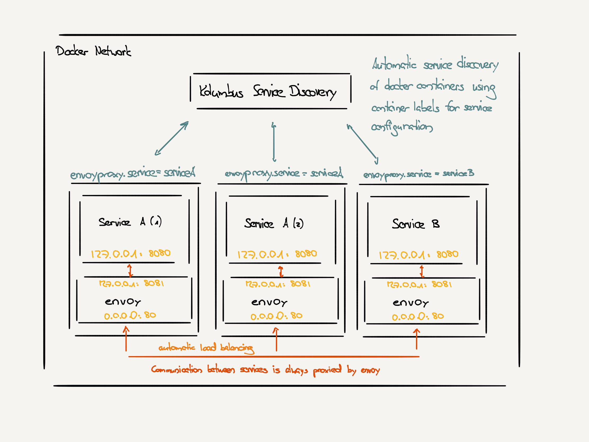

# Kolumbus: Creating a service mesh with docker and envoyproxy

Docker makes it easy to package your applications and run it reliably in
different environments.

However, orchestrating multiple containers with load balancing, rate limiting,
dynamic replacement of services, monitoring and all the nice operational stuff
can quickly become quite cumbersome.

Given our current move to a microservice architecture that makes heavy use of
the grpc framework, we were looking for a simple solution.

Up until now, we were managing our services manually with caddyserver as proxy
and were quite happy with this. We did look into traefik as a possible alternative
but found that it is not really what we were looking for.

With envoyproxy and its sidecar philosophy we found a solution that seems to
work very well with our setup. One of the great things about it, is that
envoyproxy instances can fetch almost all of the configuration dynamically.

This allowed us to write a simple orchestration service ("kolumbus"), that
will watch all docker containers in the same network and use simple docker labels
(very similar to traefik) to dynamically generate the configuration required
to run an envoyproxy service mesh.

In addition the kolumbus container starts its own internal envoyproxy process,
which makes it trivial to connect local services for development purposes.

Finally, it is possible to even automatically fallback to services on a remote
cluster (i.e. your integration testing server) with very little configuration.

An example on how it can be used in development and production is given
in the examples directory.

Please note that `Kolumbus` is currently pretty new and we are still working on
several aspects to improve the user experience.

Kolumbus is provided as docker container from dkfbasel/kolumbus.
